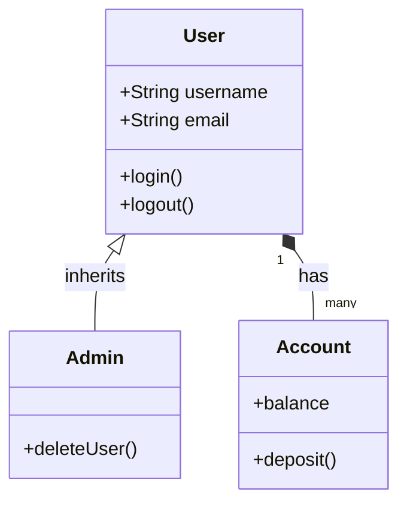
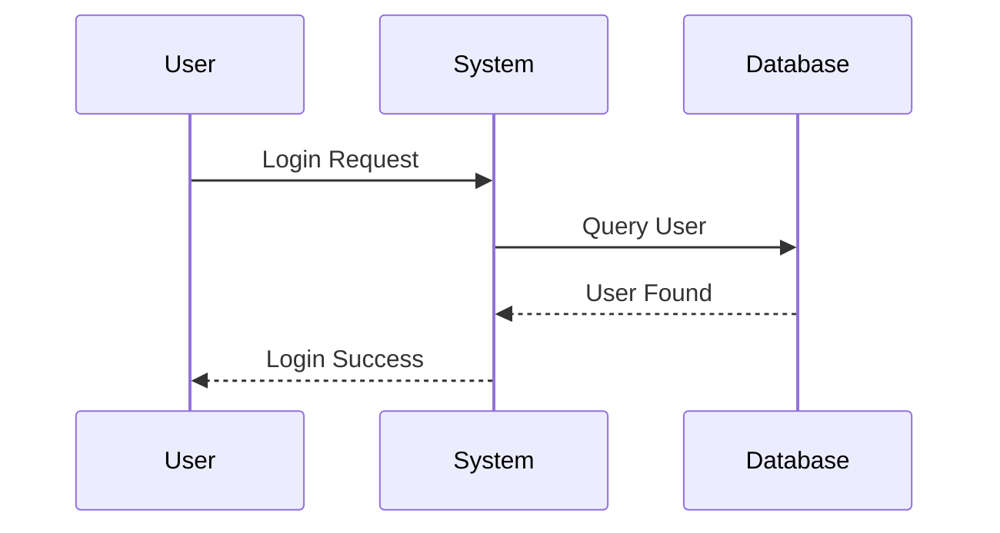
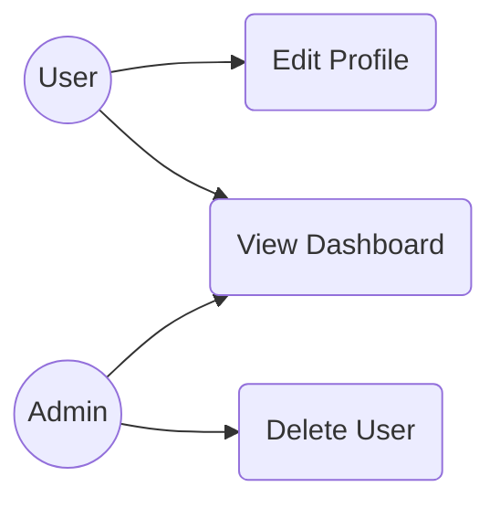
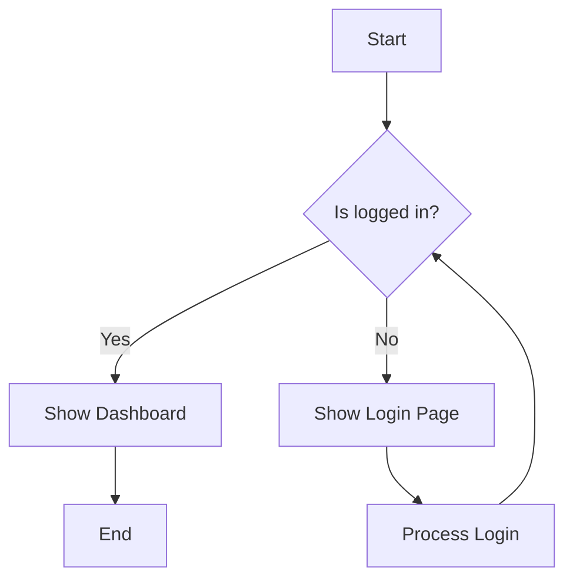
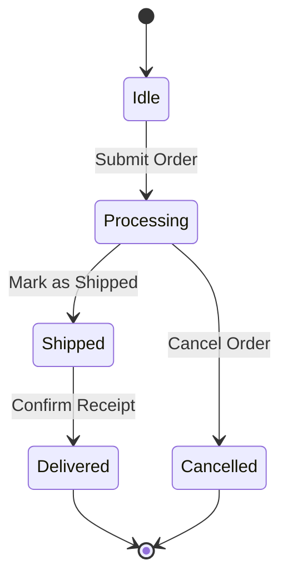

# 📊 UML Diagrams

Unified Modeling Language (UML) is a standardized modeling language consisting of an integrated set of diagrams, developed to help system and software developers for specifying, visualizing, constructing, and documenting the artifacts of software systems.

---

## 🗺️ Table of Contents
1. [Class Diagram](#1-class-diagram)
2. [Sequence Diagram](#2-sequence-diagram)
3. [Use Case Diagram](#3-use-case-diagram)
4. [Activity Diagram](#4-activity-diagram)
5. [State Diagram](#5-state-diagram)

---

## 1. Class Diagram
The Class Diagram is the main building block of object-oriented modeling. It is used for general conceptual modeling of the structure of the application, and for detailed modeling translating the models into programming code.

---

## 2. Sequence Diagram
Sequence diagrams describe interactions among classes in terms of an exchange of messages over time.

---

## 3. Use Case Diagram
Use case diagrams describe what a system does from the standpoint of an external observer. The emphasis is on what a system does rather than how.

---

## 4. Activity Diagram
Activity diagrams are graphical representations of workflows of stepwise activities and actions with support for choice, iteration, and concurrency.

---

## 5. State Diagram
State diagrams are used to describe the behavior of a system. State diagrams describe all of the possible states of an object as events occur.

